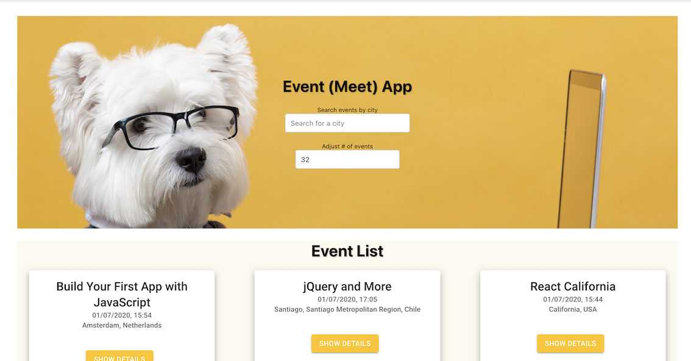
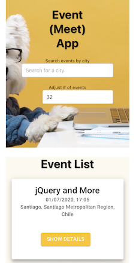

# Meet App

## Project Description

The Meet App is a React-based web application that provides users with the ability to discover and filter events happening in various cities. It integrates with the Google Calendar API, follows the OAuth2 authentication flow, and offers offline functionality with the help of a service worker. The app is designed to be responsive, works well on different screen sizes, and meets the Lighthouse PWA checklist criteria. Additionally, users can install the app on their desktop and add it to their mobile home screen for easy access.

## Table of Contents

- [How to Install and Run the Project](#how-to-install-and-run-the-project)
- [How to Use the Project](#how-to-use-the-project)
- [Screenshots] (#screenshots)
- [Technologies Used](#technologies-used)
- [Credits](#credits)
- [License](#license)

## How to Install and Run the Project

To run the Meet App locally, follow these steps:

1. Clone this repository to your local machine.
2. Navigate to the project directory.
3. Run the following commands:

```bash
npm install
npm start
```

This will start the development server, and the app will be accessible in your web browser at http://localhost:3000.

## How to Use the Project

Once the app is running, you can perform the following actions:

### Features

    Filter events by city.
    Show/hide event details.
    Specify the number of events to display.
    Use the app offline to view previously viewed events.
    Add a shortcut to the app on your device's home screen.
    View charts visualizing event details categorized by cities.

Please note that the app integrates with the Google Calendar API, so authentication may be required for certain features.

## Screenshots


Web view


Mobile view

## Technologies Used

The Meet App is built using the following technologies:

    - React
    - Test-Driven Development (TDD) technique
    - Google Calendar API with OAuth2 authentication flow
    - AWS Lambda (serverless functions)
    - Responsive design for various screen sizes
    - Lighthouse PWA checklist compliance
    - Service worker for offline functionality
    - Installation as a Progressive Web App (PWA)
    - Implementation of an alert system using Object-Oriented Programming (OOP)
    - Data visualization features

Thank you for choosing Meet App! If you have any questions, encounter issues, or have feedback, please don't hesitate to [reach out](https://github.com/meet-app/issues). We're here to make your event experience exceptional.
